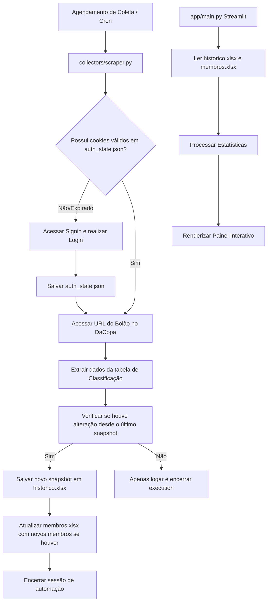

# Documento Técnico — Bolão Copa (Copa do Mundo 2026)

Este documento especifica a arquitetura técnica, as escolhas de tecnologias e o fluxo de dados para a aplicação "Bolão Copa".

---

## 1. Escolha de Tecnologias (Tech Stack)

### 1.1 Backend e Automação
*   **Linguagem de Programação:** Python 3.10+
    *   *Razão:* Excelente ecossistema de manipulação de dados (`pandas`), bibliotecas maduras de raspagem de dados/automação e suporte simples a interfaces web dinâmicas.
*   **Biblioteca de Automação:** Playwright (Python)
    *   *Razão:* Execução robusta de navegadores em modo *headless* ou *headed*, excelente tratamento de carregamento de páginas assíncronas (Single Page Applications - SPAs), suporte nativo para salvar e carregar estados de login (`auth_state.json`), além de menor consumo de recursos em comparação com o Selenium.

### 1.2 Frontend (Dashboard)
*   **Framework Web:** Streamlit
    *   *Razão:* Fornece uma maneira declarativa de gerar UIs de visualização de dados de forma ágil, com gráficos interativos e controles responsivos nativos em Python. Dispensa o desenvolvimento de uma API separada e o uso de JS complexo no frontend na primeira versão.
*   **Visualização de Dados:** Plotly Express
    *   *Razão:* Gráficos altamente interativos, responsivos e fáceis de customizar (essenciais para o gráfico temporal com o Eixo Y invertido, onde a posição 1 deve aparecer no topo).

### 1.3 Armazenamento e Persistência
*   **Formato de Armazenamento:** Planilhas Excel (`.xlsx`)
    *   *Razão:* Atendimento ao requisito de não utilizar banco de dados na primeira versão.
    *   *Arquivos:*
        *   `storage/membros.xlsx`: Cadastro de membros (Nome, Arroba, ID).
        *   `storage/historico.xlsx`: Snapshots de pontuação e posições (Data/Hora, Coleta ID, Participante, Arroba, Posição, Pontos).
    *   *Manipulação:* `pandas` e `openpyxl`.

---

## 2. Estrutura de Diretórios Proposta

O projeto seguirá rigorosamente a seguinte estrutura modular:

```text
Bolao/
├── app/                  # Interface Streamlit
│   ├── main.py           # Arquivo principal de execução do Streamlit
│   └── views/            # Telas modulares (Visão Geral, Ranking, Estatísticas, etc.)
├── config/               # Arquivos de configurações e seletores
│   ├── settings.py       # Leitor de variáveis de ambiente
│   └── selectors.json    # Mapeamento dinâmico de seletores CSS do DaCopa
├── collectors/           # Automatizadores (Playwright)
│   ├── session_manager.py# Controle de autenticação e estado da sessão
│   └── scraper.py        # Captura de membros e rankings
├── storage/              # Banco de dados em formato Excel
│   ├── membros.xlsx
│   ├── historico.xlsx
│   └── auth_state.json   # Cookies e localStorage salvos do login
├── assets/               # Imagens, temas e assets visuais
├── logs/                 # Registro detalhado de atividades
│   ├── collector.log     # Logs de execuções do robô de coleta
│   └── app.log           # Logs de acesso e uso do Streamlit
├── tests/                # Testes unitários para cálculos de estatísticas
└── docs/                 # Documentos de especificação (Sprint 0 e outros)
```

---

## 3. Fluxo de Dados e Coleta



---

## 4. Estratégias de Recuperação e Logs

*   **Logs:** Registro detalhado usando a biblioteca nativa `logging` do Python, gravando o timestamp, nível (INFO, WARNING, ERROR) e descrição da operação nos arquivos da pasta `logs/`.
*   **Recuperação de Falhas:** Em caso de erro na coleta de dados (ex: internet instável, seletor alterado ou login falho), o script Playwright capturará um screenshot da tela de erro para depuração (salvo em `logs/error_screenshot.png`), registrará a stack trace no log e encerrará o processo de forma limpa, sem corromper as planilhas do banco de dados Excel. A persistência histórica usará cópias de segurança temporárias ao escrever no Excel para evitar corrompimento de dados.

---

## 5. Próximos Passos (Planejamento de Sprints)

*   **Sprint 1:** Implementação do Login Automatizado via Playwright, geração de sessão (`auth_state.json`) e configuração segura de credenciais.
*   **Sprint 2:** Escrita do script de extração da lista de membros do grupo para o arquivo `membros.xlsx`.
*   **Sprint 3:** Escrita do coletor do ranking atual da rodada (geração de snapshots).
*   **Sprint 4:** Implementação da lógica de persistência histórica incremental em `historico.xlsx`.
*   **Sprint 5:** Construção do Dashboard MVP em Streamlit.
*   **Sprint 6:** Desenvolvimento das estatísticas e métricas (Maior subida, Dias na liderança, etc.).
*   **Sprint 7:** Refinamento visual final com tema Copa do Mundo 2026.
